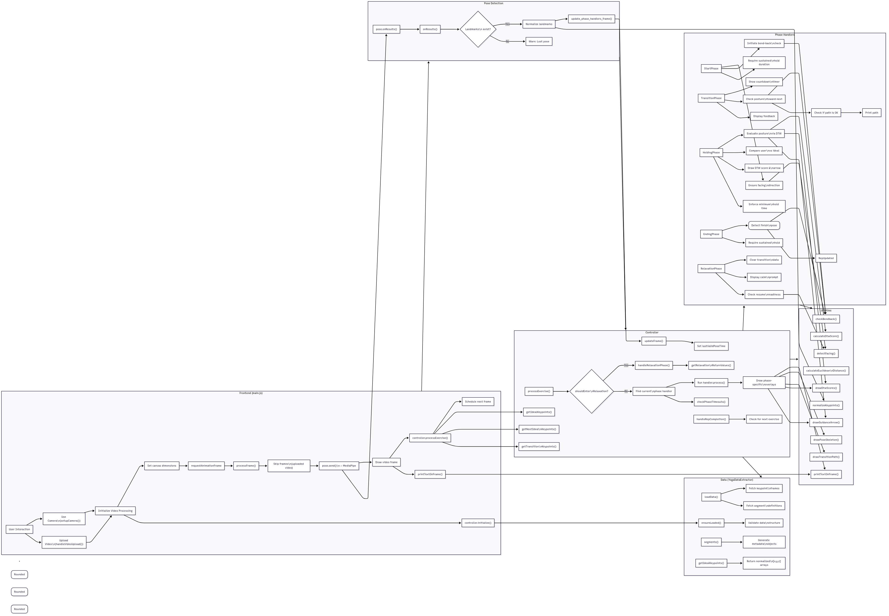

# Yoga Tracker 🧘



Yoga Tracker is a web-based application that uses computer vision to guide users through yoga exercises, track their poses, and count repetitions in real-time. It leverages MediaPipe Pose to detect 33 body keypoints and provides visual feedback to help users perfect their form.

## Key Features
- **Real-Time Pose Detection**: Track 33 body keypoints using MediaPipe
- **Phase-Based Guidance**: Step-by-step guidance through yoga phases (start, transition, hold, end)
- **Repetition Counting**: Automatic rep counting with visual feedback
- **Dynamic Feedback**: Real-time skeleton overlay with DTW scoring and guidance arrows
- **Exercise Library**: Customizable exercise definitions via JSON files
- **Relaxation Mode**: Smart recovery detection between reps

## Prerequisites
- **Node.js**: For local development server
- **Modern Browser**: Chrome/Firefox with WebGL support
- **Webcam**: For real-time pose detection

## Installation

```bash
git clone https://github.com/yourusername/yoga-tracker.git
cd yoga-tracker
```

## Data Setup
1. Create `assets/` directory in your project root
2. Add exercise JSON files with the following structure:

```json
// assets/man_keypoints_data_normalized.json
{
  "frames": [
    ["0.1,0.2,0.3", "0.4,0.5,0.6", ...],
    ...
  ],
  "segments": [
    [0, 1, "starting", [0.5, 0.3, 0.2]],
    [94, 200, "transition", [0.5, 0.3, 0.2]],
    [200, 365, "holding", [0.5, 0.3, 0.2]],
    [2, 3, "ending", [0.5, 0.3, 0.2]]
  ]
}
```
## Start Application
``` bash
# Using Python
python -m http.server 8081

# Using Node.js (install http-server globally if needed: npm i -g http-server)
npx http-server

```
Visit http://localhost:8081 in your browser
## Usage
1. **Allow camera access** when prompted
2. **Position yourself** 2-3 meters from camera with full body visible
3. **Follow on-screen guidance** through exercise phases:
   - **Starting**: Align with initial pose
   - **Transition**: Move smoothly to next position
   - **Holding**: Maintain pose while DTW score improves
   - **Ending**: Complete rep with final pose
4. **View real-time feedback**:
   - 🟢 Green skeleton: Good alignment
   - 🔴 Red skeleton: Needs correction
   - ➡️ Guidance arrows: Movement direction
   - 📊 DTW score: Pose accuracy (lower = better)

## Project Structure
```bash
yoga-tracker/
├── assets/
│   ├── images/              # Diagrams and screenshots
│   └── *.json               # Exercise data files
├── controller/
│   ├── controller.js        # Main state machine
│   ├── yoga.js              # Exercise data loader
│   ├── phase_handlers.js    # Phase-specific logic
│   └── transition_analysis.js
├── utils/
│   ├── camera_utils.js      # Canvas drawing functions
│   ├── fastDtw.js           # DTW algorithm
│   └── utils.js             # Math utilities
├── index.html               # Main UI
├── main.js                  # App entry point
└── README.md
```

### Add New Exercises
1. Create new JSON file in `assets/` directory
2. Add to exercise plan in `main.js`:

```javascript
// main.js
const exercisePlan = {
  "Warrior II": {
    "json_path": "assets/warrior_ii.json",
    "reps": 5
  },
  "Tree Pose": {
    "json_path": "assets/tree_pose.json",
    "reps": 3
  }
};
```